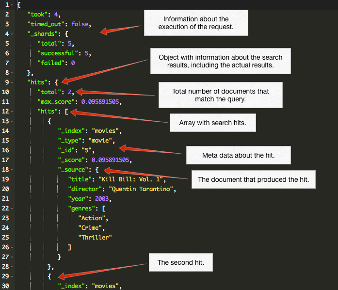

name: inverse
layout: true
class: center, middle, inverse
---

#ElasticSearch
###is a search server based on Lucene
.footnote[@korel-san]

???

- Эластик серч это поисковый движок основанный на Апач Люцен
- The Apache Lucene — это свободная библиотека для высокоскоростного полнотекстового поиска, написанная на Java.
- Apache Lucene - Может быть использована для поиска в интернете и при решении различных задач вычислительной лингвистики.
Исходя из собственного опыта, этот движок написан не для простых смертных людей.. (следующий слайд)

---


???

И сильно подозреваю что с ним может сходу разобраться только вот некто вроде него

К сожалению я не из таких, и мне пришлось повозиться, прежде чем понять логику :)

---

#*18+*

???
Да, заранее предупрежу, доклад может содержать не очень цензурные картинки

---

#Advantages
###1) distributed search execution

???
Итак, каковы же преимущества эластиксерча?

1) распределенный поиск

Это немного сложнее, чем обычные CRUD запросы.

В CRUD операциях мы всегда знаем с каким именно объектом иметь дело
и соответственно какую именно часть в кластере занимает наш документ

Но распределенный поиск требует более сложной модели исполнения, потому что мы заранее не знаем какие документы будут соответствовать запросу:
они могут быть в любом сегменте кластера. Поисковый запрос должен просматривать копию каждого сегмента
по одному или нескольким индексам на соответствие критериям.

Кроме того, найти все соответствующие документы, это только полдела. Результаты нескольких сегментов должны быть объеденены в единый отсортированный список, прежде чем поисковое API
сможет вернуть страницу результатов. По этой причине, поиск выполняется в двух фазах: запрос (query) и компоновка (fetch)

--
###2) multitenant-capable

???
2) многоарендаторная (многоклиенсткая, многопользовательская) архитектура - это специальный прием программирования или архитектурное решение, поддерживающее одновременное использование одного и того же экземпляра программы несколькими клиентами.

Есть возможность контроля/разграничения доступа на основе ролей

--

###3) full-text search

???
3) полнотекстовый поиск, само собой

--

###4) RESTful web interface

???
4) поддержка RESTful web interface

--

###5) schema-free JSON documents

???
5) Схемалес объекты JSON

---


# *#NotBad*

???
Как по мне так уже достаточный набор преимуществ, на которые стоит обратить внимание

---

## 6) is released as open source under the terms of the Apache License
## 7) is the second most popular enterprise search engine (Solr is the first one)

???
6) открытый исходный код под лицензией Апача

7) второе место среди самых популярных поисковых энтерпрайз движков

И еще много много другого.

Хорошо, о достоинствах поговорили. Как на счет недостатков?

---

#Disadvantages
###1) developed in Java

???
Разработан на Джаве

--

###2) high barriers to entry

???
Высокий порог вхождения

Простые запросы вы конечно научитесь писать довольно быстро. Но я не видела еще проекта, где задачи для движка
полнотекстового поиска соответствовали бы простым запросам. Чаще всего нужны какие-то подвыподверты.

---


# *#ImTooSexy* *#ImSexyAndIKnowIt*

???
Ну а кто из нас не имеет недостатков?

---

# How could we start to use ElasticSearch?
# We have a few tools for it

---
layout: false
.left-column[
# Curl in console
### Initializing mapping and settings (for products index)
]
.right-column[
```
curl -X PUT "http://localhost:9200/products" -d '{
"mappings" : {
    "product" : {
        "properties" : {
            "type": { "type": "string", "store": "yes"},
            "description": {
                "type": "string",
                "index_analyzer": "str_search_analyzer",
                "search_analyzer" : "str_search_analyzer",
                "store": "yes"
            }
        }
    }
},
"settings" : {
    "analysis" : {
        "analyzer" : {
            "str_search_analyzer" : {
                "tokenizer" : "keyword",
                "filter" : ["lowercase"]
            },
            "str_index_analyzer" : {
                "tokenizer" : "keyword",
                "filter" : ["lowercase", "substring"]
            }
        },
        "filter" : {
          "substring" : { "type" : "nGram", "min_gram" : 3, "max_gram"  : 20 }
        }
    }
}}'; echo
```
]

???
Абсолютно реальный запрос из консоли. Урезанная версия :)

Чем консоль плоха?

Нет возможности отменить изменения какого-то символа,

поправить отступы,

сделать замену по тексту,

сложно переключаться между запросами

---
class: center, middle, inverse


# *#Nope*

???
Это не наш метод!

В общем не буду тянуть, мой выбор пал на официальный пакет от той же конторы

---
template: inverse


# Marvel
### http://localhost:9200/_plugin/marvel/sense/index.html

???
Устанавливается очень просто.

http://www.elastic.co/guide/en/elasticsearch/guide/current/sense_widget.html?snippets/070_Index_Mgmt/40_Custom_dynamic_mapping.json

* Необходимо будет пройти по инструкциям и установить все необходимые пакеты

После установки можно открыть браузер на странице

http://localhost:9200/

---
class: center, middle

.center[]

???
Если все установится нормально, то при повторном обновлении окошка увидите что-то вроде этого:

Чрезвычайно удобный отладчик запросов.

Запускать можно только те запросы, которые нужны в данный момент (для каждого из них справа кнопка запуска)

И в том порядке в каком удобно.

Также работает валидация + адекватные табы.

Совершенно понятный язык в который можно ставлять обычный JSON (даже не форматированный)

** Проверить версию эластиксерча в браузере localhost:9200/_nodes/_all/process?pretty

Если марвелом не пользоваться, можно писать запросы в браузере, но их отладка, особенно когда количество символов переваливает за 200 - нереальная задача:

http://localhost:9200/_all/_settings
http://localhost:9200/_all/_mapping

---
template: inverse

## * Fiddle2
## * Composer
## * Scratchpad
## * JMeter, chrome-extension
## * Custom REST scripts

???
По правде сказать, есть еще несколько вариантов где можно запускать запросы,
но все они ущербны, по сравнению с марвелом

---
class: middle, inverse

## Basic Concepts
####Near Realtime (NRT)edit
######Elasticsearch is a near real time search platform. What this means is there is a slight latency (normally one second) from the time you index a document until the time it becomes searchable.
####Cluster
######A cluster is a collection of one or more nodes (servers) that together holds your entire data and provides federated indexing and search capabilities across all nodes
####Node
######A node is a single server that is part of your cluster, stores your data, and participates in the cluster’s indexing and search capabilities.
####Index
######An index is a collection of documents that have somewhat similar characteristics.
####Type
######Within an index, you can define one or more types. A type is a logical category/partition of your index whose semantics is completely up to you.
####Document
######A document is a basic unit of information that can be indexed. A document is a JSON document which is stored in elasticsearch.
####Shards & Replicas
######Horizontally split/scale out your search volume, distribute and parallelize operations across shards, high availability in case a shard/node fails

???
index - database
type - collection

---
class: middle, inverse

## Glossary of terms
####mapping
######A mapping is like a schema definition in a relational database.
####source field
######By default, the JSON document that you index will be stored in the _source field and will be returned by all get and search requests.
####term
######A term is an exact value that is indexed in elasticsearch.
####text
######Text (or full text) is ordinary unstructured text, such as this paragraph. By default, text will be analyzed into terms, which is what is actually stored in the index.
####analysis
######Analysis is the process of converting full text to terms.

---
class: middle, inverse

##Request examples
##### http://localhost:9200/_search - Search across all indexes and all types.
##### http://localhost:9200/movies/_search - Search across all types in the movies index.
##### http://localhost:9200/movies/movie/_search - Search explicitly for documents of type movie within the movies index.

---
template: inverse

#ElasticSearch in use

---
class:middle

### Simple search with formatted output
```
curl -XGET http://localhost:9200/products/_search?pretty=true -d'{
  "query": {
    "match_all": {}
  }
}'
```
#### is equal to (in Marvel)
```
GET http://localhost:9200/products/_search?pretty=true&text=
{
  "query": {
    "match_all": {}
  }
}
```
#### is equal to url
http://localhost:9200/products/_search?source={"query":{"match_all":{}}}

---
template: inverse

##Modifying Your Data (CRUD)
###Indexing/Replacing Documents
###Updating Documents
###Deleting Documents
###Batch Processing

---
class:middle

###Indexing/Replacing Documents
```
curl -XPUT 'localhost:9200/customer/external/1?pretty' -d '
{
  "name": "John Doe"
}'
```
```
curl -XPUT 'localhost:9200/customer/external/1?pretty' -d '
{
  "name": "Jane Doe"
}'
```
```
curl -XPUT 'localhost:9200/customer/external/2?pretty' -d '
{
  "name": "Jane Doe"
}'
```
```
curl -XPOST 'localhost:9200/customer/external?pretty' -d '
{
  "name": "Jane Doe"
}'
```

---
class:middle

###Updating Documents
```
curl -XPOST 'localhost:9200/customer/external/1/_update?pretty' -d '
{
  "doc": { "name": "Jane Doe" }
}'
```
```
curl -XPOST 'localhost:9200/customer/external/1/_update?pretty' -d '
{
  "doc": { "name": "Jane Doe", "age": 20 }
}'
```
```
curl -XPOST 'localhost:9200/customer/external/1/_update?pretty' -d '
{
  "script" : "ctx._source.age += 5"
}'
```

---
class:middle

###Deleting Documents
```
curl -XDELETE 'localhost:9200/customer/external/2?pretty'
```
```
curl -XDELETE 'localhost:9200/customer/external/_query?pretty' -d '
{
  "query": { "match": { "name": "John" } }
}'
```

---
class:middle

###Batch Processing
```
curl -XPOST 'localhost:9200/customer/external/_bulk?pretty' -d '
  { "index": { "_id": "1" } }
  { "name": "John Doe" }
  { "index": { "_id": "2"} }
  { "name": "Jane Doe" }
'
```
```
curl -XPOST 'localhost:9200/customer/external/_bulk?pretty' -d '
  { "update": { "_id": "1" } }
  { "doc": { "name": "John Doe becomes Jane Doe" } }
  { "delete": { "_id": "2" } }
'
```

---
template: inverse

##Query Language

---
class: middle
###Queries are JSON objects with the following structure (each of the main sections has more detail below):
```
{
    size: # number of results to return (defaults to 10)
    from: # offset into results (defaults to 0)
    fields: # list of document fields that should be returned .red.bold[1*]
    sort: # define sort order .red.bold[2*]
    query: {
        # "query" object following the Query DSL .red.bold[3*]
        # details below
    },
    facets: {
        # facets specifications
        # Facets provide summary information about a particular field
        # or fields in the data
    }
    # special case for situations where you want to apply filter/query
    # to results but *not* to facets
    filter: {
        # filter objects
        # a filter is a simple "filter" (query) on a specific field.
        # Simple means e.g. checking against a specific value or range of values
    }
}
```
- [1*] http://elasticsearch.org/guide/reference/api/search/fields.html
- [2*] http://elasticsearch.org/guide/reference/api/search/sort.html
- [3*] http://elasticsearch.org/guide/reference/query-dsl/

---
template: inverse

##Search result

---
template: inverse


---
class: middle

###Query results look like
```
{
    # some info about the query (which shards it used, how long it took etc)
    ...
    # the results
    hits: {
        total: # total number of matching documents
        hits: [
            # list of "hits" returned
            {
                _id: # id of document
                score: # the search index score
                _source: {
                    # document 'source'
                    # (i.e. the original JSON document you sent to the index)
                }
            }
        ]
    }
    # facets if these were requested
    facets: {
        ...
    }
}
```

---
template: inverse

## Types of queries

---
class: middle, inverse
####match_all
######Return all documents from endpoint (index and type)
####terms (exact values)
######Works only for not_analyzed or terms strings. It refers with the result of analyzer work
####match (multi_match, match_phrase, match_phrase_prefix)
######Complex query could consist of terms and query_string. It has couple types of result sorting
####query_string
######Simple queries as regexp
####query
######As a general rule, queries should be used instead of filters: for full text search, where the result depends on a relevance score
####filter
######As a general rule, filters should be used instead of queries: for binary yes/no searches, for queries on exact values

???
Когда я первый раз выписала список всех типов запросов, у меня была такая реакция (следующий слайд)

---
template: inverse


---
template: inverse

##Couple simple examples time!

---
class:middle

### Classic Search-Box Style Full-Text Query
```
curl -XGET http://localhost:9200/products/_search -d'{
  "query": {
    "query_string": {
       "query": "Dubai"
    }
  },
  "sort": [{"_score": "desc"}]
}'
```

### Search with specified query string
```
curl -XGET http://localhost:9200/products/_search -d'{
  "query": {
    "query_string": {
       "query": "Dubai AND 30?"
    }
  }
}'
```

---
class:middle

### Search with all nested value
```
curl -XGET http://localhost:9200/products/_search -d'{
  "query": {
    "query_string": {
       "fields": ["descriptions.*"],
       "query": "Dubai"
    }
  }
}'
```

### Search with specified nested value
```
curl -XGET http://localhost:9200/products/_search -d'{
  "query": {
    "match": {
      "descriptions.en.metaDescription": {
        "query": "Platinum",
        "type": "phrase_prefix"
      }
    }
  }
}'
```

---
class:middle

### Full-Text Query plus Filter on a Field
```
GET /products/_search
{
  "query": {
    "filtered": {
      "query": {
        "match": { "descriptions.en.metaDescription": "Platinum" }
      },
      "filter": {
        "fquery": { "query": { "match": { "type": "credit-card" } } }
      }
    }
  }
}
```

### Analyze word
```
curl -XGET http://localhost:9200/products/_analyze -d 'Dubai'
```
####is equal to (in Marvel)
```
GET http://localhost:9200/products/_analyze?text='Dubai'
```

---
class:middle

### Filter on two fields
```
GET /products/_search
{
 "query": {
   "filtered": {
      "query": { "match_all": {} },
      "filter": {
        "and": [
          { "ids": { "values": ["1","2","3","4","5","6"] } },
          { "range" : { "b" : { "from" : 4, "to" : "8" } } },
          { "term": { "type": "credit-card" } }
        ]
      }
    }
  }
}
```

???
Здесь уже показывать не буду, тут в принципе и так понятно

---
class: middle

###Highlighting
```
GET http://localhost:9200/products/_search?pretty=true&text=
{
  "query": {
    "multi_match": {
      "query": "Dubai",
      "fields": ["descriptions.*"]
    }
  },
  "highlight": {
    "number_of_fragments": 3,
    "fragment_size": 150,
    "tag_schema": "styled",
    "fields": {
      "_all": {
        "pre_tags": [ "<em>" ],
        "post_tags": [ "</em>" ]
      },
      "descriptions.en.name": { "number_of_fragments": 0 },
      "descriptions.en.metaDescription": { "number_of_fragments": 0 },
      "descriptions.en.benefits": { "number_of_fragments": 5, "order": "score" }
    }
  }
}
```

---
class: middle

###Highlighting result
```
{
  [...]
  "highlight": {
     "descriptions.en.metaDescription": [
        "<em>Dubai</em> First offers the <em>Dubai</em>
        Moments Titanium Card by MasterCard at a rate of 3.90% on Souqalmal.com"
     ],
     "descriptions.en.name": [
        "<em>Dubai</em> Moments Titanium Card"
     ],
     "descriptions.en.benefits": [
        " benefits with partners which encompass lifestyle, entertainment,
        shopping, dining, jewellery, wellness; Earn <em>Dubai</em>
        Dinar rewards and redeem against gift",
        " vouchers from brands, shopping malls, utilities and online transactions;
        Priceless Arabia benefits; 24-Hour Roadside Assistance;
        Use <em>Dubai</em> Moments card"
     ]
  }
}
```

---
class: middle

###Geospatial Query to find results near a given point
```
curl -XGET http://localhost:9200/products/_search -d'{
   "query": {
       "filtered" : {
           "query" : {
               "match_all" : {}
           },
           "filter" : {
               "geo_distance" : {
                   "distance" : "20km",
                   "Location" : {
                       "lat" : 37.776,
                       "lon" : -122.41
                   }
               }
           }
       }
   }
}'
```

???
К сожалению достойного примера уне нашлось, чтобы показать фильтрацию по геопозици в действии

В любом случае оно будет искать точку в радиусе 20 км от указанной

---
class:center,middle,inverse

##More complex examples time!

???
А теперь более сложные примеры

---
class:middle

###Ngrams
####- mapping
####- put
####- get
####- result

######http://sense.qbox.io/gist/6f5519cc3db0772ab347bb85d969db14d85858f2

???
Это своего рода анализаторы текста. Т/е/ к примеру у вас есть текст (или даже объект состоящий из свойств в которых находится текст)

И вам необходимо найти все документы, в каком-то списке свойств которых есть искомый текст (который может быть началом слова,
серединой, окончанием, или даже промежуточным значением: "lo wo")

чем это удобно? любая часть текста может быть найдена (конечно же в зависимости от того как вы настроите анализатор)

Эластик ищет только СОВПАДАЮЩИЙ текст. Он не сможет вывести вам ответ, в случае если вы опечатались.

---
####- mapping
```
PUT /test_index
{
   "settings": {
      "number_of_shards": 1,
      "analysis": {
         "tokenizer": {
            "ngram_tokenizer": { "type": "nGram", "min_gram": 4, "max_gram": 4 }
         },
         "analyzer": {
            "ngram_tokenizer_analyzer": {
              "type": "custom", "tokenizer": "ngram_tokenizer"
            }
         }
      }
   },
   "mappings": {
      "doc": {
         "properties": {
            "text_field": {
              "type": "string",
              "term_vector": "yes",
              "analyzer": "ngram_tokenizer_analyzer"
            }
         }
      }
   }
}```

---
class:middle

####- put
```
PUT /test_index/doc/1
{
    "text_field": "Hello, World!"
}
```

####- get
```
GET /test_index/doc/1/_termvector?fields=text_field
```

---
class:middle

####- result
```
{
   "_index": "test_index", "_type": "doc", "_id": "1", "_version": 1,
   "found": true,
   "term_vectors": {
      "text_field": {
         "field_statistics": {
          "sum_doc_freq": 10,
          "doc_count": 1,
          "sum_ttf": 10
         },
         "terms": {
            " Wor": { "term_freq": 1 },
            ", Wo": { "term_freq": 1 },
            "Hell": { "term_freq": 1 },
            "Worl": { "term_freq": 1 },
            "ello": { "term_freq": 1 },
            "llo,": { "term_freq": 1 },
            "lo, ": { "term_freq": 1 },
            "o, W": { "term_freq": 1 },
            "orld": { "term_freq": 1 },
            "rld!": { "term_freq": 1 }
         }
      }
   }
}
```

---
class:middle

###Index-Time Search-as-You-Type
####- mapping
####- analyze
####- update mapping
####- bulk create
####- search
####- result

######http://localhost:9200/_plugin/marvel/sense/index.html?load_from=http://www.elastic.co/guide/en/elasticsearch/guide/current/snippets/130_Partial_Matching/35_Search_as_you_type.json

???
Более продвинутая версия ngrama
Хороша тем, что может выводить результаты, даже если вы еще не допечатали текст до конца
Например в гугле вам выпадает список возможных фраз когда вы набираете текст в поисковой строке
Ограничение на длину поиска задается в settings

---
class:middle

####- mapping
```
PUT /my_index
{
    "settings": {
        "number_of_shards": 1,
        "analysis": {
            "filter": {
                "autocomplete_filter": {
                    "type":     "edge_ngram",
                    "min_gram": 1,
                    "max_gram": 20
                }
            },
            "analyzer": {
                "autocomplete": {
                    "type":      "custom",
                    "tokenizer": "standard",
                    "filter": [
                        "lowercase",
                        "autocomplete_filter"
                    ]
                }
            }
        }
    }
}
```

---
class:middle

####- analyze
```
GET /my_index/_analyze?analyzer=autocomplete
quick brown
```

####- update mapping
```
PUT /my_index/_mapping/my_type
{
    "my_type": {
        "properties": {
            "name": {
                "type":     "string",
                "analyzer": "autocomplete"
            }
        }
    }
}
```

####- bulk create
```
POST /my_index/my_type/_bulk
{ "index": { "_id": 1            }}
{ "name": "Brown foxes"    }
{ "index": { "_id": 2            }}
{ "name": "Yellow furballs" }
```

---
class:middle

####- search
```
GET /my_index/my_type/_search
{
    "query": {
        "match": {
            "name": "brown fo"
        }
    }
}
```

####- result
```
{

  "hits": [
     {
        "_id": "1", "_score": 1.5753809, "_source": { "name": "Brown foxes" }
     },
     {
        "_id": "2", "_score": 0.012520773, "_source": { "name": "Yellow furballs" }
     }
  ]
}
```

---
class:middle

### Ngrams for Compound Words
####- mapping
####- analyze
####- bulk create
####- search
####- result

######http://localhost:9200/_plugin/marvel/sense/index.html?load_from=http://www.elastic.co/guide/en/elasticsearch/guide/current/snippets/130_Partial_Matching/40_Compound_words.json

???
Еще более крутая навороченная штука: ngram для длинных сложных слов, как например в немецком языке

---
class:middle

####- mapping
```
PUT /my_index
{
    "settings": {
        "analysis": {
            "filter": {
                "trigrams_filter": {"type": "ngram","min_gram": 3, "max_gram": 3}
            },
            "analyzer": {
                "trigrams": {
                    "type":      "custom",
                    "tokenizer": "standard",
                    "filter":   ["lowercase", "trigrams_filter"]
                }
            }
        }
    },
    "mappings": {
        "my_type": {
            "properties": {
                "text": {"type": "string", "analyzer": "trigrams"}
            }
        }
    }
}
```

---
class:middle

####- analyze
```
GET /my_index/_analyze?analyzer=trigrams
Weißkopfseeadler
```

####- bulk create
```
POST /my_index/my_type/_bulk
{ "index": { "_id": 1 }}
{ "text": "Aussprachewörterbuch" }
{ "index": { "_id": 2 }}
{ "text": "Militärgeschichte" }
{ "index": { "_id": 3 }}
{ "text": "Weißkopfseeadler" }
{ "index": { "_id": 4 }}
{ "text": "Weltgesundheitsorganisation" }
{ "index": { "_id": 5 }}
{ "text": "Rindfleischetikettierungsüberwachungsaufgabenübertragungsgesetz" }
```

---
class:middle

####- search
```
GET /my_index/my_type/_search
{
    "query": {
        "match": {
            "text": "Adler"
        }
    }
}
```

####- result
```
{
  "hits": [
     {
        "_id": "3",
        "_score": 3.3191128,
        "_source": {
           "text": "Weißkopfseeadler"
        }
     }
  ]
}
```

---
class:middle

###Dynamic mapping + analyze any string field
```
PUT /my_index
{
    "mappings": {
        "my_type": {
            "dynamic":      "strict",
            "properties": {
                "title":  { "type": "string"},
                "stash":  {
                    "type":     "object",
                    "dynamic":  true
                }
            }
        }
    }
}
```

```
PUT /my_index/my_type/1
{
    "title":   "This doc adds a new field",
    "stash": { "new_field": "Success!" }
}
```

```
PUT /my_index/my_type/1
{
    "title":     "This throws a StrictDynamicMappingException",
    "new_field": "Fail!"
}
```

######http://localhost:9200/_plugin/marvel/sense/index.html?load_from=http://www.elastic.co/guide/en/elasticsearch/guide/current/snippets/070_Index_Mgmt/40_Custom_dynamic_mapping.json

???
Динамический маппинг необходим лишь для подстройки маппинга, в случае когда сам эластик не знает что делать с новым полем,
которое было добавлено в документ (для некоторых полей динамический маппинг, который по умолчанию включен, можно отключить)

В идеале необходимо разнести языковые строки по разным индексам
(или хотябы по типам, потому что навернуть что-то еще поверх динамических маппингов будет сложно)

---
class:middle

###Suggests
####- mapping
####- put
####- suggest
####- result

######http://blog.qbox.io/quick-and-dirty-autocomplete-with-elasticsearch-completion-suggest

???
Саджесты - очень клевая штука тогда, когда вам необходимо искать текст с опечатками и перепутанными буквами

Эластик проанализирует все поля которые вы ему укажете, и затем предложит документы в порядке их схожести с текстом

---
class:middle

####- mapping
```
curl -XPUT "http://localhost:9200/test_index/" -d'
{
   "mappings": {
      "product": {
         "properties": {
            "description": {
               "type": "string"
            },
            "tags": {
               "type": "string"
            },
            "title": {
               "type": "string"
            },
            "tag_suggest": {
               "type": "completion",
               "index_analyzer": "simple",
               "search_analyzer": "simple",
               "payloads": false
            }
         }
      }
   }
}'
```

---
class:middle

####- put
```
curl -XPUT "http://localhost:9200/test_index/product/1" -d'
{
   "title": "Product1",
   "description": "Product1 Description",
   "tags": [ "blog", "magazine", "responsive", "two columns", "wordpress" ],
   "tag_suggest": {
      "input": [ "blog", "magazine", "responsive", "two columns", "wordpress" ]
   }
}'
```
```
curl -XPUT "http://localhost:9200/test_index/product/2" -d'
{
   "title": "Product2",
   "description": "Product2 Description",
   "tags": [ "blog", "paypal", "responsive", "skrill", "wordland" ],
   "tag_suggest": {
      "input": [ "blog", "paypal", "responsive", "skrill", "wordland" ]
   }
}'
```

---
class:middle

####- suggest
```
curl -XPOST "http://localhost:9200/test_index/_suggest" -d'
{
    "product_suggest":{
        "text":"word",
        "completion": {
            "field" : "tag_suggest"
        }
    }
}'
```

####- result
```
{
   "_shards": {
      "total": 1,
      "successful": 1,
      "failed": 0
   },
   "product_suggest": [
      {
         "text": "word", "offset": 0, "length": 4,
         "options": [
            { "text": "wordland", "score": 1 },
            { "text": "wordpress", "score": 1 }
         ]
      }
   ]
}
```

---
class:middle, inverse

##We didn't talk about:
####- Multi Search API
####- Aggregations
####- Facets
####- Count API
####- More Like This API
####- Filter API
####- Bulk API
####- Indices APIs
####- Queries and Filters
####Mapping/Analysis/Modules and so on..

???
1) К примеру можно делать запросы напрямую к эластиксерчу из фронтенда за счет аякс запроса

2) матчить можно как строку так и объект или его часть

3) можно комбинировать фильтры, но есть нюансы их использования

4) порядок действий - ВАЖЕН

5) можно менять порядок сортировки не только по возрастанию и убыванию.
есть способ указать в query какие документы выводить первыми и логику указывать самому (best_fields, most_fields, cross_fields, phrase, phrase_prefix)

6) разного вида группировки

---
template: inverse


# *#BlackMaster*

???
Ну и на последок парочку примеров из БДСМ практик

---
class: center, middle, inverse
# Script fields

---
layout: false
.left-column[
  ## Script fields
  ### - name of the script field
  ### - script function
  ### - list of params
]
.right-column[

Script could get any params and use current state of the document:
```remark
{
    "query" : {
        ...
    },
    "script_fields" : {
        {{"test1"}} : {
            "script" : "doc['my_field_name'].value * 2"
        },
        "test2" : {
            "script" : "doc[{{'test1'}}].value * {{factor}}",
            "params" : {
                {{"factor"}}  : 2.0
            }
        }
    }
}
```

]

???
Давайте попробуем разобраться чуть поглубже
doc - это текущее состояние документа

---
.left-column[
  ## Script fields
  ### - _source document
  ### - _index
  ### - _type
  ### - _id
  ### - get properties of any object in document
  ### - doc
]
.right-column[
  What we could get?

```remark
{
    "query" : {
        ...
    },
    "script_fields" : {
        "test1" : {
            "script" : {{"_source.obj1.obj2"}}
        }
    }
}
```
]

???
Можно обращаться к исходномому объекту через _source, можно получать значения из свойств объекта

---
.left-column[
  ## Script fields
  #### Elasticsearch have a vulnerability in the Groovy scripting engine
]
.right-column[
  Check file .red.bold[config/elasticsearch.yml]

  ```remark
  script.groovy.sandbox.enabled: false
  ```

  Simple script as an example:

  ```remark
  GET /_search
  {
      "script_fields": {
          "my_field": {
              "script_file": "{{my_script}}",
              "params": {
                "my_var": 2
              }
          }
      }
  }
  ```

  And store script file in .red.bold[config/scripts/my_script.groovy] with content

  ```remark
    1 + my_var
  ```

  See the [complete list](https://www.elastic.co/guide/en/elasticsearch/reference/current/search-request-script-fields.html) of script fields facilities.
]

???
Пожалуй единственная "неудобность" в том, что надо включать специальную настройку у эластика

---
template: inverse
# Questions?

---
template: inverse
# Thank you
.footnote[
[@korel-san](https://twitter.com/korery)

[korery@gmail.com](https://twitter.com/korery)
]
