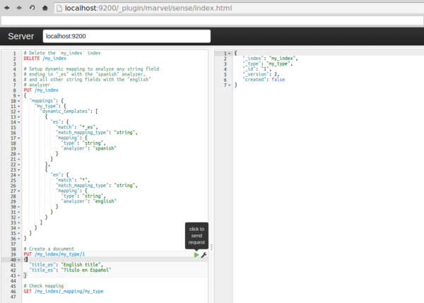

name: inverse
layout: true
class: center, middle, inverse
---

#ElasticSearch
###is a search server based on Lucene
.footnote[@korel-san]

???

- Эластик серч это поисковый движок основанный на Апач Люцен
- The Apache Lucene — это свободная библиотека для высокоскоростного полнотекстового поиска, написанная на Java.
- Apache Lucene - Может быть использована для поиска в интернете и при решении различных задач вычислительной лингвистики.
- Например, Lucene используется как компонент в децентрализованной поисковой системе YaCy [Ya see] (свободное ПО).
- YaCy (от англ. Yet another Cyberspace, Ещё одно Киберпространство; созвучно с англ. Ya see) — свободно распространяемая децентрализованная поисковая система, построенная по принципу одноранговых сетей (P2P)
Исходя из собственного опыта, этот движок написан не для простых смертных людей.. (следующий слайд)

---


???

И сильно подозреваю что с ним может сходу разобраться только вот некто вроде него

К сожалению я не из таких, и мне пришлось повозиться, прежде чем понять логику :)

---

#*18+*

???
Да, заранее предупрежу, доклад может содержать нецензурные картинки

---

#Advantages
###1) distributed search execution

???
Итак, каковы же преимущества эластиксерча?

1) распределенный поиск

Это немного сложнее, чем обычные CRUD запросы.

В CRUD операциях мы всегда знаем с каким именно объектом иметь дело
и соответственно какую именно часть в кластере занимает наш документ

Но распределенный поиск требует более сложной модели исполнения, потому что мы заранее не знаем какие документы будут соответствовать запросу:
они могут быть в любом сегменте кластера. Поисковый запрос должен просматривать копию каждого сегмента
по одному или нескольким индексам на соответствие критериям.

Кроме того, найти все соответствующие документы, это только полдела. Результаты нескольких сегментов должны быть объеденены в единый отсортированный список, прежде чем поисковое API
сможет вернуть страницу результатов. По этой причине, поиск выполняется в двух фазах: запрос (query) и компоновка (fetch)

--
###2) multitenant-capable

???
2) многоарендаторная (многоклиенсткая, многопользовательская) архитектура - это специальный прием программирования или архитектурное решение, поддерживающее одновременное использование одного и того же экземпляра программы несколькими клиентами.

Есть возможность контроля/разграничения доступа на основе ролей

--

###3) full-text search

???
3) полнотекстовый поиск, само собой

--

###4) RESTful web interface

???
4) поддержка RESTful web interface

--

###5) schema-free JSON documents

???
5) Схемалес объекты JSON

---


# *#NotBad*

???
Как по мне так уже достаточный набор преимуществ, на которые стоит обратить внимание

---

#Yes, but NO

---

## 6) is released as open source under the terms of the Apache License
## 7) is the second most popular enterprise search engine (Solr is the first one)

???
6) открытый исходный код под лицензией Апача

7) второе место среди самых популярных поисковых энтерпрайз движков

И еще много много другого.

Хорошо, о достоинствах поговорили. Как на счет недостатков?

---

#Disadvantages
###1) developed in Java

???
Разработан на Джаве

--

###2) high barriers to entry

???
Высокий порог вхождения

Простые запросы вы конечно научитесь писать довольно быстро. Но я не видела еще проекта, где задачи для движка
полнотекстового поиска соответствовали простым запросам. Чаще всего нужны какие-то подвыподверты.

---


# *#ImTooSexy* *#ImSexyAndIKnowIt*

???
Ну а кто из нас не имеет недостатков?

---

# How could we start to use ElasticSearch?
# We have a few tools for it

---
layout: false
.left-column[
# Curl in console
### Initializing mapping and settings (for some collection)
]
.right-column[
```
curl -X PUT "http://localhost:9200/products" -d '{
"mappings" : {
    "product" : {
        "properties" : {
            "type": { "type": "string", "store": "yes"},
            "description": {
                "type": "string",
                "index_analyzer": "str_search_analyzer",
                "search_analyzer" : "str_search_analyzer",
                "store": "yes"
            }
        }
    }
},
"settings" : {
    "analysis" : {
        "analyzer" : {
            "str_search_analyzer" : {
                "tokenizer" : "keyword",
                "filter" : ["lowercase"]
            },
            "str_index_analyzer" : {
                "tokenizer" : "keyword",
                "filter" : ["lowercase", "substring"]
            }
        },
        "filter" : {
          "substring" : { "type" : "nGram", "min_gram" : 3, "max_gram"  : 20 }
        }
    }
}}'; echo
```
]

???
Абсолютно реальный запрос из консоли. Урезанная версия :)

Чем консоль плоха?

Нет возможности нормально поправить один символ,

поправить отступы

и

сделать замену по тексту,

геморно переключаться между запросами

---
class: center, middle, inverse


# *#Nope*

???
Это не наш метод!
В общем не буду тянуть, мой выбор пал на официальный пакет от той же конторы
---
template: inverse


# Marvel
### http://localhost:9200/_plugin/marvel/sense/index.html

???
Устанавливается очень просто:

http://www.elastic.co/guide/en/elasticsearch/guide/current/sense_widget.html?snippets/070_Index_Mgmt/40_Custom_dynamic_mapping.json

Необходимо будет пройти по инструкциям и установить все необходимые пакеты

После установки можно открыть браузер на странице

http://localhost:9200/

---
class: middle

.center[]

##### http://localhost:9200/_search - Search across all indexes and all types.
##### http://localhost:9200/movies/_search - Search across all types in the movies index.
##### http://localhost:9200/movies/movie/_search - Search explicitly for documents of type movie within the movies index.

???
Если все установится нормально, то при повторном обновлении окошка увидите что-то вроде этого:
https://screencloud.net/v/kTmO
Чрезвычайно удобный отладчик запросов.
Запускать можно только те запросы, которые нужны в данный момент (для каждого из них справа кнопка запуска)

И в том порядке в каком удобно.

Также работает валидация + адекватные табы.

Совершенно понятный язык в который можно ставлять обычный JSON (даже не форматированный)

Проверить версию эластиксерча в браузере localhost:9200/_nodes/_all/process?pretty

Если марвелом не пользоваться, можно писать запросы в браузере, но их отладка, особенно когда количество символов переваливает за 200 - нереальная задача:
http://localhost:9200/_all/_settings
http://localhost:9200/_all/_mapping

---
template: inverse

## * Fiddle2
## * Composer
## * Scratchpad
## * JMeter, chrome-extension
## * Custom REST scripts

???
По правде сказать, есть еще несколько вариантов где можно запускать запросы,
но все они ущербны, по сравнению с марвелом

---
template: inverse

#ElasticSearch in use

---
class:middle

### Formatted output
```
curl -XGET http://localhost:9200/products/_search?pretty=true -d'{
  "sort" : [
    "_score"
  ],
  "query": {
    "query_string":{
      "query": "Card"
    }
  }
}'
```
#### is equal to (in Marvel)
```
GET http://localhost:9200/products/_search?pretty=true&text=
{
  "sort": [
    "_score"
  ],
  "query": {
    "query_string": {
      "query": "Card"
    }
  }
}
```

---
template:inverse

## Types of queries:
### - query
### - text
### - filter
### - match (multi_match, match_phrase, match_phrase_prefix, match_all)
### - query_string

---
class:middle

### Simple search
```
curl -XGET http://localhost:9200/products/_search -d'{
  "query": {
    "text": {"_all": "Dubai"},
    "type": "phrase_prefix"
  },
  "sort": [{"_score": "desc"}]
}'
```

### Search with all nested value
```
curl -XGET http://localhost:9200/products/_search -d'{
  "query": {
    "query_string": {
      "fields": ["descriptions.*"],
      "query": "Dubai"
    }
  }
}'
```

---
class:middle

### Search with specified nested value
```
curl -XGET http://localhost:9200/products/_search -d'{
  "query": {
    "text": {
      "descriptions.en.metaDescription": {
        "query": "Platinum",
        "type": "phrase_prefix"
      }
    }
  }
}'
```

### Search with specified query string
```
curl -XGET http://localhost:9200/products/_search -d'{
  "query": {
    "query_string": {
      "query": "Dubai AND 195?"
    }
  }
}'
```

---
class:middle

### Analyze word
```
curl -XGET http://localhost:9200/products/_analyze -d 'Dubai'
```
#### is equal to (in Marvel)
```
GET http://localhost:9200/products/_analyze?text='Dubai'
```

???
А теперь приведу пару интересных примеров

---
class:middle

### Ngrams for Compound Words
```
PUT /my_index
{
    "settings": {
        "analysis": {
            "filter": {
                "trigrams_filter": {"type": "ngram","min_gram": 3, "max_gram": 3}
            },
            "analyzer": {
                "trigrams": {
                    "type":      "custom",
                    "tokenizer": "standard",
                    "filter":   ["lowercase", "trigrams_filter"]
                }
            }
        }
    },
    "mappings": {
        "my_type": {
            "properties": {
                "text": {"type": "string", "analyzer": "trigrams"}
            }
        }
    }
}
```

---
class:middle
### Search example for ngram

```
GET /my_index/my_type/_search
{
    "query": {
        "match": {
            "text": "Adler"
        }
    }
}
```

???
Ngram для сложных слов

Живой пример:
http://localhost:9200/_plugin/marvel/sense/index.html?load_from=http://www.elastic.co/guide/en/elasticsearch/guide/current/snippets/130_Partial_Matching/40_Compound_words.json

---
class:middle

### Real search with filter and query
```
GET http://localhost:9200/products/_search
{
  "query": {
    "filtered": {
      "query": {
        "match_all": {}
      },
      "filter": {
        "and": [
          {
            "ids": {
              "values": [
                "543858c488de100000b0e9c2",
                "543858c488de100000b0e9c4",
                "543858c688de100000b0ea98",
                "543858c788de100000b0ea9e",
                "543858c788de100000b0eac2",
                "543858c788de100000b0ead8",
                "543858c888de100000b0eb1e",
                "543858c988de100000b0eb29",
                "547c0e0a50ae9a1e073e5464"
              ]
            }
          }
        ]
      }
    }
  }
}
```

???
Вот еще из простеньких запросов

1) матчить можно как строку так и объект или его часть

2) можно комбинировать фильтры (в данном случае энд просто для того чтобы показать что это возможно)

3) порядок действий - ВАЖЕН

4) можно менять порядок сортировки не только по возрастанию и убыванию.
есть способ указать в query какие документы выводить первыми и логику указывать самому (best_fields, most_fields, cross_fields, phrase, phrase_prefix)

5) агрегирование

6) suggests (к примеру можно делать запросы напрямую к эластиксерчу из фронтенда за счет аякс запроса)


---
template: inverse


# *#BlackMaster*

???
Ну и на последок парочку примеров из БДСМ практик

---
class: center, middle, inverse
# Script fields

---
layout: false
.left-column[
  ## Script fields
  ### - name of the script field
  ### - script function
  ### - list of params
]
.right-column[

Script could get any params and use current state of the document:
```remark
{
    "query" : {
        ...
    },
    "script_fields" : {
        {{"test1"}} : {
            "script" : "doc['my_field_name'].value * 2"
        },
        "test2" : {
            "script" : "doc[{{'test1'}}].value * {{factor}}",
            "params" : {
                {{"factor"}}  : 2.0
            }
        }
    }
}
```

]

???
Давайте попробуем разобраться чуть поглубже
doc - это текущее состояние документа

---
.left-column[
  ## Script fields
  ### - _source document
  ### - _index
  ### - _type
  ### - _id
  ### - get properties of any object in document
  ### - doc
]
.right-column[
  What we could get?

```remark
{
    "query" : {
        ...
    },
    "script_fields" : {
        "test1" : {
            "script" : {{"_source.obj1.obj2"}}
        }
    }
}
```
]

???
Можно обращаться к исходномому объекту через _source, можно получать значения из свойств объекта

---
.left-column[
  ## Script fields
  #### Elasticsearch have a vulnerability in the Groovy scripting engine
]
.right-column[
  Check file .red.bold[config/elasticsearch.yml]

  ```remark
  script.groovy.sandbox.enabled: false
  ```

  Simple script as an example:

  ```remark
  GET /_search
  {
      "script_fields": {
          "my_field": {
              "script_file": "{{my_script}}",
              "params": {
                "my_var": 2
              }
          }
      }
  }
  ```

  And store script file in .red.bold[config/scripts/my_script.groovy] with content

  ```remark
    1 + my_var
  ```

  See the [complete list](https://www.elastic.co/guide/en/elasticsearch/reference/current/search-request-script-fields.html) of script fields facilities.
]

???
Пожалуй единственная "неудобность" в том, что надо включать специальную настройку у эластика

---
template: inverse
# Questions?

---
template: inverse
# Thank you
.footnote[
[@korel-san](https://twitter.com/korery)

[korery@gmail.com](https://twitter.com/korery)
]
